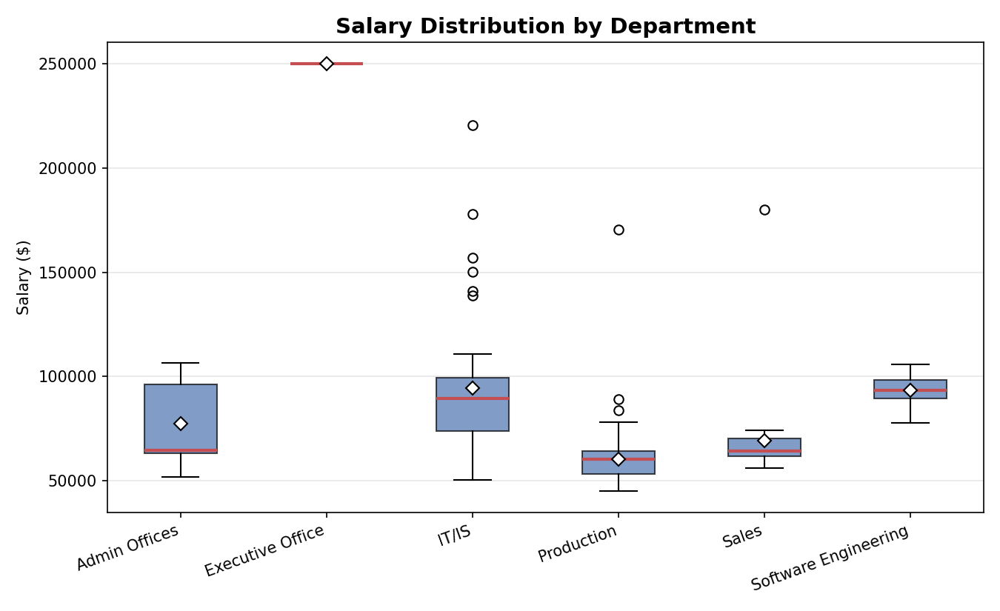
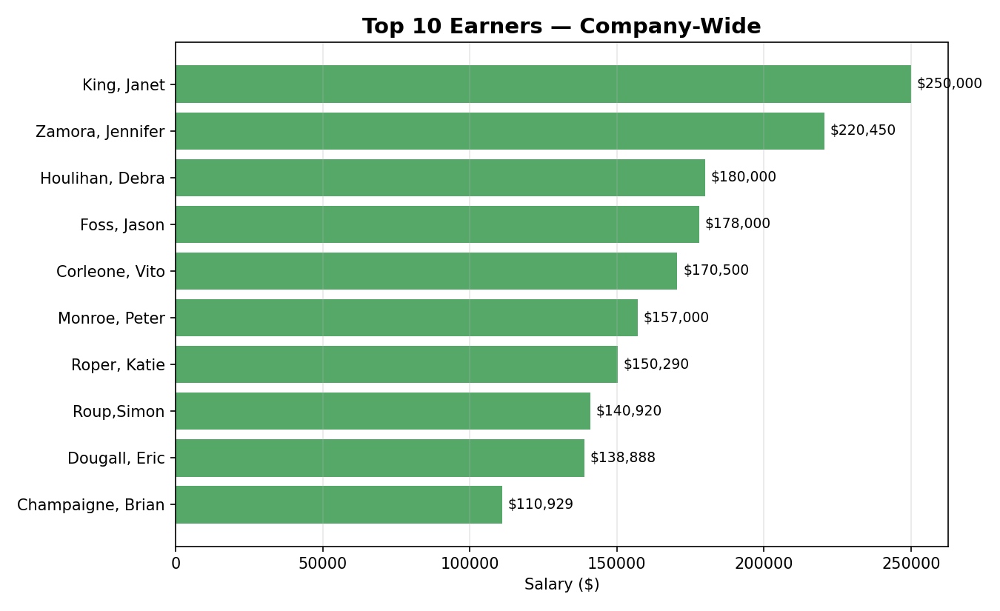
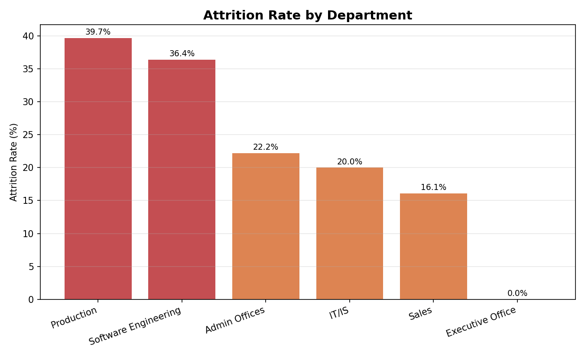
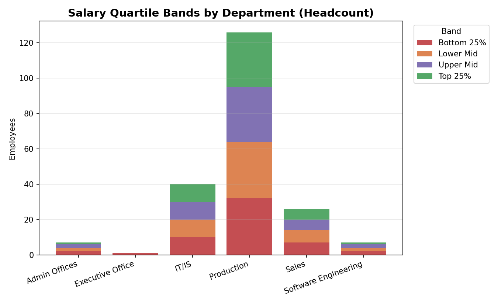

# Employee Performance Dashboard (SQL Server)

Analyzing 311 employees from the HRDataset_v14 dataset using SQL window
functions to rank performance, surface salary outliers, and quantify
attrition — the kind of analysis HR and compensation teams run at banks
and large enterprises.

## Why this project

Most beginner SQL projects stop at `SELECT`, `JOIN`, and `GROUP BY`. This
one focuses on **window functions** — `RANK`, `DENSE_RANK`, `ROW_NUMBER`,
`NTILE`, and `PARTITION BY` — which is where SQL interviews and real
analyst work actually live: comparing an individual to their group,
building percentile/quartile bands, and detecting outliers.

## Business questions answered

1. Rank employees within each department by salary
2. Compare each employee's salary to their department average
3. Identify the top 10% of earners company-wide
4. Calculate attrition rate by job role and department
5. Flag employees with 5+ years in the same role (tenure/promotion proxy)
6. **Stretch:** Build salary quartile bands (Bottom 25% → Top 25%) per department
7. **Bonus:** Flag salary outliers using z-scores (>2 std devs from department mean)

## Tech stack

- **SQL Server (T-SQL)** — all analysis queries
- **Dataset:** [HRDataset_v14](https://www.kaggle.com/datasets/rhuebner/human-resources-data-set) (311 employees, real salary/department/tenure data)
- Charts below generated from actual query output for the writeup

## Key techniques demonstrated

```sql
-- Compare every employee to their department's average salary
SELECT
    Department,
    Employee_Name,
    Salary,
    ROUND(AVG(Salary) OVER (PARTITION BY Department), 2) AS dept_avg_salary,
    ROUND(Salary - AVG(Salary) OVER (PARTITION BY Department), 2) AS diff_from_dept_avg
FROM employees
WHERE EmploymentStatus = 'Active';
```

```sql
-- Salary quartile bands per department (pay-equity style analysis)
WITH quartiles AS (
    SELECT Department, Employee_Name, Salary,
           NTILE(4) OVER (PARTITION BY Department ORDER BY Salary) AS salary_quartile
    FROM employees
    WHERE EmploymentStatus = 'Active'
)
SELECT *,
    CASE salary_quartile
        WHEN 1 THEN 'Bottom 25%' WHEN 2 THEN 'Lower Mid'
        WHEN 3 THEN 'Upper Mid' WHEN 4 THEN 'Top 25%'
    END AS salary_band
FROM quartiles;
```

Full script: [`Employee_Performance_Analysis.sql`](./Employee_Performance_Analysis.sql)

## Key findings

- **Salary spread is widest in IT/IS** — ranges from entry-level support roles up past $200K for senior architects, more than any other department.
- **The highest-attrition roles aren't the lowest-paid ones** — several specialized IT/IS roles (DBA, Enterprise Architect) show attrition at or near 50–100%, pointing to retention risk in scarce-skill positions rather than a simple pay problem.
- **Executive Office is a department of one** — a good reminder that department-level averages can be misleading for very small groups; worth noting when presenting results.

## Screenshots

**Salary distribution by department**


**Top 10 earners, company-wide**


**Attrition rate by department**


**Salary quartile bands by department**


## Assumptions & limitations

- No promotion-history table exists in the source data, so "years in
  same role without promotion" (question 5) is proxied by tenure in the
  currently-listed position for active employees. Called out explicitly
  rather than presented as ground truth.
- Attrition rate is calculated as (terminated ÷ everyone who ever held
  that role), including employees who have since left — this is a
  standard historical-attrition definition, not a headcount-today metric.

## How to run

1. Import `HRDataset_v14.csv` into SQL Server (Import Wizard or `BULK INSERT`) as a table named `employees`
2. Run `employee_performance_dashboard_sqlserver.sql`

## Files
_______________________________________________________________________________________________
|                       File                     |                Description                 |
|------------------------------------------------|--------------------------------------------|
| `employee_performance_dashboard_sqlserver.sql` | All analysis queries                       |
| `HRDataset_v14.csv`                            | Source dataset                             |
| `chart*.png`                                   | Visualizations generated from query output |
_______________________________________________________________________________________________
